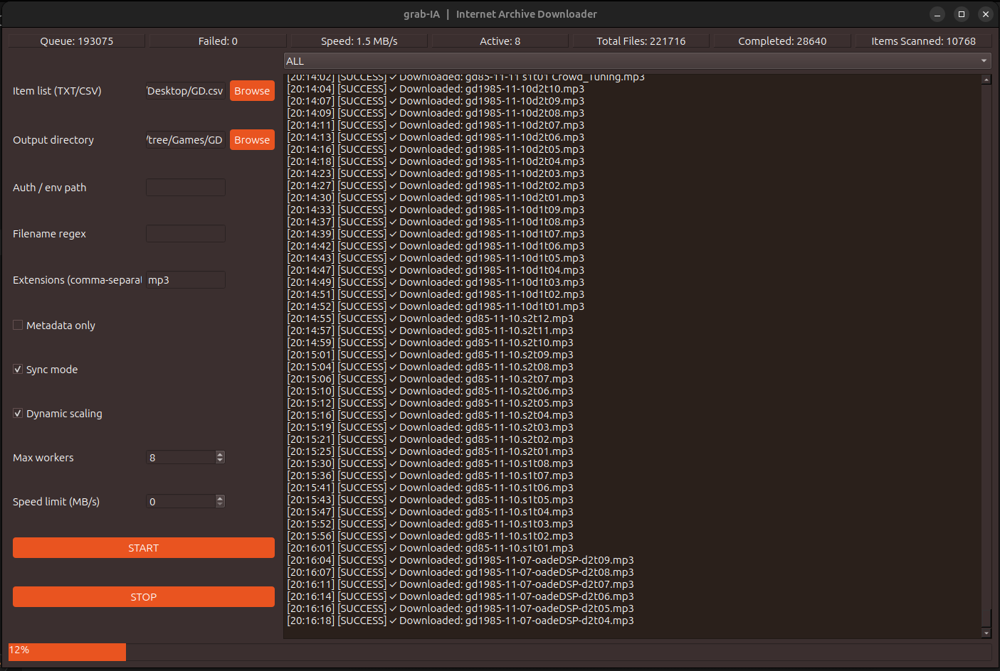

# grab-IA

A thread-safe, resilient downloader for Internet Archive items with GUI, CLI, and Docker support.

 <p align="center">
  
</p>


## Features

- **🖥️ Multiple Interfaces**: GUI, CLI, or headless Docker
- **🔄 Resume Support**: Seamlessly switch between GUI and CLI
- **⚡ High Performance**: Multi-threaded downloads with dynamic scaling
- **🛡️ Robust**: MD5 verification, byte-level resume, global backoff
- **🎯 Flexible Filtering**: Regex patterns, extension whitelists, metadata-only mode
- **🔐 Authentication**: Optional S3 credentials for restricted Archive.org items
- **💾 Persistent State**: SQLite database tracks all downloads
- **🚀 Production Ready**: Docker support for servers and Kubernetes

 ## Quick Start

 ### The easiest way (GUI)

 Run the launcher. It will automatically set up everything and open the GUI.

 ```bash
 python3 launch.py
 ```

 Windows users (if `python3` is not available):

 ```bat
 python launch.py
 ```

 Optional (Linux / macOS):

 ```bash
 chmod +x launch.py
 ./launch.py
 ```

 ---

 ### Command-line usage (CLI)

 Start a new download job:

 ```bash
 python3 grabia_cli.py start --items items.txt --output ./downloads
 ```

 Resume an existing job:

 ```bash
 python3 grabia_cli.py resume --output ./downloads
 ```

 Check job status:

 ```bash
 python3 grabia_cli.py status --output ./downloads
 ```

 ---

 ### CLI convenience wrappers (optional)

 Linux / macOS:

 ```bash
 ./grab-ia.sh start --items items.txt --output ./downloads
 ```

 Windows:

 ```bat
 grab-ia.bat start --items items.txt --output .\downloads
 ```

 ---

 ### Notes

 - GUI and CLI share the same job database (`grabia_state.db`)
 - Jobs can be resumed across GUI and CLI
 - Downloads are resumable and verified for integrity

### Docker (Recommended for Production)

```bash
# Build image
docker build -t grab-ia .

# Run download job
docker run -it --rm \
  -v $(pwd)/downloads:/downloads \
  -v $(pwd)/items:/items \
  grab-ia:latest \
  start --items /items/items.txt --output /downloads --workers 8
```

## Installation

### Prerequisites
- Python 3.8 or higher
- Internet connection

### Method 1: Automated (Recommended)
The launcher scripts automatically create a virtual environment and install dependencies.

**No manual installation needed!** Just run `python3 launch.py` (or `python launch.py` on Windows).


### Method 2: Manual
```bash
# Create virtual environment
python -m venv venv

# Activate virtual environment
source venv/bin/activate  # Linux/macOS
venv\Scripts\activate     # Windows

# Install dependencies
pip install -r requirements.txt
```

### Method 3: pip install (Coming Soon)
```bash
pip install grab-ia
```

## Usage

### GUI Interface

1. **Load Item List**: Browse for a TXT or CSV file with Archive.org identifiers
2. **Set Output Directory**: Choose download destination
3. **Configure Options**:
   - Max workers: Concurrent downloads (1-64)
   - Speed limit: Bandwidth cap in MB/s
   - Sync mode: Skip existing files
   - Dynamic scaling: Auto-adjust workers
   - Metadata only: Download only metadata
4. **Start**: Click START and monitor progress

### CLI Interface

#### Start New Job
```bash
python grabia_cli.py start \
  --items items.txt \
  --output ./downloads \
  --workers 16 \
  --speed-limit 50 \
  --sync \
  --dynamic
```

#### Resume Job (works with GUI jobs too!)
```bash
python grabia_cli.py resume \
  --output ./downloads \
  --workers 8
```

#### Check Status
```bash
python grabia_cli.py status --output ./downloads
```

#### Advanced Filtering
```bash
# Download only MP3 and FLAC files
python grabia_cli.py start \
  --items items.txt \
  --output ./downloads \
  --extensions mp3,flac

# Use regex filter
python grabia_cli.py start \
  --items items.txt \
  --output ./downloads \
  --filter ".*live.*\\.mp3$"

# Metadata only
python grabia_cli.py start \
  --items items.txt \
  --output ./downloads \
  --metadata-only
```

#### Verbose Output
```bash
python grabia_cli.py start \
  --items items.txt \
  --output ./downloads \
  --verbose
```

### Docker Deployment

See [DOCKER.md](DOCKER.md) for comprehensive Docker documentation.

#### Quick Examples

**Headless download:**
```bash
docker run -d \
  -v $(pwd)/downloads:/downloads \
  -v $(pwd)/items:/items \
  grab-ia:latest \
  start --items /items/items.txt --output /downloads --workers 8
```

**With Docker Compose:**
```bash
docker-compose up -d grab-ia-cli
docker-compose logs -f grab-ia-cli
```

**Resume in Docker:**
```bash
docker run -it --rm \
  -v $(pwd)/downloads:/downloads \
  grab-ia:latest \
  resume --output /downloads
```

## Architecture

### Core Components

- **grabia_core.py**: Thread-safe download engine with SQLite persistence
- **grabia_gui.py**: PySide6 GUI with live metrics and log viewer
- **grabia_cli.py**: Command-line interface with progress monitoring
- **launch.py**: Cross-platform launcher with automatic setup


### State Management

All interfaces (GUI and CLI) share the same SQLite database:

```
downloads/
├── grabia_state.db       # Shared state database
├── item_id_1/
│   ├── README.txt        # Auto-generated metadata
│   ├── file1.mp3
│   └── file2.pdf
└── item_id_2/
    └── ...
```

You can **start in GUI, stop, and resume in CLI** (or vice versa). The state is always preserved.

## Configuration

### GUI Settings

All settings are available in the GUI sidebar:
- Item list (TXT/CSV)
- Output directory
- Auth/credentials (optional)
- Filename regex filter
- Extension whitelist
- Max workers
- Speed limit
- Sync mode
- Dynamic scaling
- Metadata only

### Authentication (Optional)

Some Internet Archive items are restricted and require an account to download. grab-IA supports S3-style credentials that allow you to access items you have permission to download while logged in on archive.org.

#### When Do You Need This?

You will see `HTTP 401` errors in the log for files that require authentication. Public items never require credentials. Restricted items include patron-only uploads, items under lending restrictions, and collections that require an archive.org account.

#### Getting Your S3 Keys

1. Log in to your Internet Archive account at [archive.org](https://archive.org)
2. Go to **https://archive.org/account/s3.php**
3. Your **S3 Access Key** and **S3 Secret Key** will be shown on that page
4. Keep these private — they grant download access to your account

#### Creating a Credentials File

Create a plain text file (e.g. `ia_credentials.env`) anywhere on your system with this format:

```
S3_ACCESS_KEY=your_access_key_here
S3_SECRET_KEY=your_secret_key_here
```

Lines starting with `#` are treated as comments and ignored:

```
# grab-IA credentials - keep this file private
S3_ACCESS_KEY=your_access_key_here
S3_SECRET_KEY=your_secret_key_here
```

#### Using Credentials in the GUI

Enter the full path to your credentials file in the **Auth / env path** field in the sidebar before clicking START. The log will confirm `✓ Credentials loaded from auth file` when the file is read successfully.

#### Using Credentials in the CLI

Pass the path to your credentials file with the `--auth` flag:

```bash
python grabia_cli.py start --items items.txt --output ./downloads --auth ./ia_credentials.env
python grabia_cli.py resume --output ./downloads --auth ./ia_credentials.env
```

The startup output will confirm whether credentials were loaded:
```
   Auth: ✓ Credentials loaded
```
or
```
   Auth: None (public access)
```

#### Security Notes

- **Never commit your credentials file to version control.** Add `*.env` to your `.gitignore`.
- The credentials file is read once at job start and is not stored anywhere by grab-IA.
- If the file path is left empty, grab-IA runs in public (unauthenticated) mode — this is the default and works for the vast majority of Archive.org content.


### CLI Options

```bash
python grabia_cli.py start --help
```

| Option | Description | Default |
|--------|-------------|---------|
| `--items` | Path to items list (TXT/CSV) | Required |
| `--output` | Output directory | Required |
| `--workers` | Max concurrent workers | 8 |
| `--speed-limit` | Bandwidth limit (MB/s, 0=unlimited) | 0 |
| `--sync` | Skip existing files | False |
| `--dynamic` | Enable dynamic scaling | False |
| `--metadata-only` | Download metadata only | False |
| `--filter` | Filename regex pattern | None |
| `--extensions` | Comma-separated extensions | None |
| `--auth` | Path to credentials file | None |
| `--verbose` | Show detailed logs | False |

### Environment Variables (Docker)

| Variable | Description | Default |
|----------|-------------|---------|
| `OUTPUT_DIR` | Default output directory | `/downloads` |

## Item List Format

### TXT Format (Simple)
```
item_identifier_1
item_identifier_2
item_identifier_3
```

### CSV Format (With Metadata)
```csv
identifier
item_id_1
item_id_2
item_id_3
```

## Features in Detail

### Intelligent Resume
- Downloads resume from exact byte position
- Works across restarts and crashes
- MD5 verification ensures integrity
- Seamless GUI ↔ CLI switching

### Dynamic Scaling
- Starts with 1 worker
- Scales up after 5 consecutive successes
- Scales down immediately on failure
- Respects `--workers` maximum

### Global Backoff
- Coordinates across all workers
- Triggers on 429 (rate limit) or 503 (server error)
- Random backoff: 30-60 seconds
- Prevents thundering herd

### Bandwidth Control
- Token-bucket algorithm
- Smooth rate limiting
- Per-byte throttling
- No burst spikes

### Filtering
- **Regex**: Match filenames with patterns
- **Extensions**: Whitelist specific types
- **Anti-clutter**: Auto-skip system files
- **Metadata-only**: Just README/XML/JSON

## Monitoring

### GUI Metrics
- Queue depth
- Active workers
- Download speed
- Progress percentage
- Failed files
- Real-time logs

### CLI Progress
```
📊 Progress: 45.2% [123/272 files]
⚡ Speed: 8.4 MB/s
👷 Workers: 8/8 active
📦 Queue: 45 pending
❌ Failed: 2
⏱️  ETA: 15m 34s
```

### Docker Logs
```bash
docker logs -f <container_id>
```

## Directory Cleaner

The Directory Cleaner is a standalone tool for maintaining 1:1 parity between your item lists and download directories. It removes orphaned files, stray `.part` files, and unwanted formats while preserving exactly what should exist according to your Internet Archive manifests.

### Quick Start

```bash
# Launch the cleaner GUI
python grabia_cleaner.py
```

### Common Use Cases

**Remove unwanted formats:**
```
Scenario: You downloaded entire collections, but now only want MP3 files.
Solution: Run cleaner with extension filter "mp3" to remove other formats.
```

**Clean up interrupted downloads:**
```
Scenario: Downloads were interrupted, leaving .part files everywhere.
Solution: Run cleaner to remove all .part files and incomplete items.
```

**Enforce filter changes:**
```
Scenario: You want to apply new filters to existing downloads.
Solution: Configure filters in cleaner to remove non-matching files.
```

**Remove excluded items:**
```
Scenario: You updated your item list to exclude certain items.
Solution: Run cleaner to remove files from excluded items.
```

### Key Features

- **Dry-Run Mode**: Preview changes before deleting anything
- **Filter Compatibility**: Respects all main downloader filters (extensions, regex, metadata-only)
- **README Preservation**: Optional toggle to keep grab-IA generated READMEs
- **Safety First**: Confirmation dialogs and detailed logging
- **1:1 Parity**: Ensures downloads match item list exactly

### Basic Workflow

1. Select your item list (same TXT/CSV used for downloads)
2. Select your download directory
3. Configure filters (optional)
4. Enable dry-run mode (recommended)
5. Review the log to see what would be deleted
6. Uncheck dry-run and execute to perform actual deletion

### What Gets Deleted

The cleaner removes:
- ✅ `.part` files (incomplete downloads)
- ✅ Files not in Internet Archive manifest
- ✅ Entire item directories not in your item list
- ✅ Files that don't match your filter criteria
- ⚠️ README files (only if "Keep README files" is disabled)

### Example: Remove All Non-MP3 Files

```
1. Item list: music_items.txt
2. Download directory: /downloads
3. Extensions: mp3
4. Dry-run: ✓ (enabled)
5. Click START CLEANING
6. Review log - shows FLAC, M4A, etc. would be deleted
7. Uncheck dry-run
8. Click START CLEANING again
9. Only MP3 files remain
```

### Safety Features

- **Dry-run mode** enabled by default
- **Confirmation dialog** before deletion
- **Color-coded logging** for easy review
- **Stop button** to interrupt operation
- **Detailed reporting** of all changes

### Integration with Main Downloader

The cleaner uses the **same filter syntax** as the main downloader:

| Feature | Main Downloader | Cleaner |
|---------|----------------|---------|
| Extension whitelist | Downloads only specified | Keeps only specified |
| Regex filtering | Downloads matching | Keeps matching |
| Metadata-only | Downloads metadata | Keeps metadata |
| Anti-clutter | Skips system files | Removes system files |

### Full Documentation

See [CLEANER.md](CLEANER.md) for comprehensive documentation including:
- Detailed usage guide
- Filter examples
- Best practices
- Troubleshooting
- FAQ

### When to Use

Run the cleaner when:
- Changing format preferences after initial download
- Removing stray `.part` files from interrupted downloads
- Enforcing new filter criteria on existing collections
- Cleaning up after updating your item list
- Regular maintenance to remove accumulated strays

**⚠️ Important**: Always start with dry-run mode enabled to preview changes before deletion.

## Troubleshooting

### Common Issues

#### Python not found
```bash
# Install Python 3.8+
sudo apt install python3 python3-venv  # Ubuntu/Debian
brew install python3                   # macOS
# Windows: Download from python.org
```

#### Permission denied (Linux/macOS)
```bash
chmod +x launch.py
chmod +x grabia_cli.py
```

#### Virtual environment issues
```bash
# Delete and recreate
rm -rf venv
./launch.py
```

#### Docker permission denied
```bash
# Add user to docker group
sudo usermod -aG docker $USER
# Log out and back in
```

#### GUI doesn't start in Docker
```bash
# Enable X11 forwarding
xhost +local:docker
docker run -e DISPLAY=$DISPLAY -v /tmp/.X11-unix:/tmp/.X11-unix ...
```

### Debug Logs

All operations are logged to:
- **GUI**: Live log viewer with severity filtering
- **CLI**: Console output (use `--verbose` for details)
- **File**: `grabia_debug.log` in project directory

## Performance Tuning

### Optimal Worker Count
- **Fast connection**: 8-16 workers
- **Slow connection**: 4-8 workers
- **Rate-limited**: Use dynamic scaling

### Bandwidth Limiting
```bash
# Limit to 50 MB/s
python grabia_cli.py start ... --speed-limit 50
```

### Memory Usage
- ~50MB base overhead
- ~5MB per worker
- Disk I/O is the bottleneck, not RAM

## Production Deployment

### Systemd Service (Linux)
```bash
# See DOCKER.md for full systemd unit file
sudo systemctl enable grab-ia.service
sudo systemctl start grab-ia.service
```

### Docker Compose
```bash
# See docker-compose.yml
docker-compose up -d
```

### Kubernetes
```bash
# See DOCKER.md for Job/CronJob manifests
kubectl apply -f grab-ia-job.yaml
```

## Contributing

Contributions welcome! Please:
1. Fork the repository
2. Create a feature branch
3. Make your changes
4. Test thoroughly (GUI, CLI, Docker)
5. Submit a pull request
This project is actively developed; internal refactors may occur between minor versions, but CLI/GUI behavior will remain stable

## License

MIT License - see LICENSE file for details

## Acknowledgments

- Built for the Internet Archive preservation community
- Inspired by archival best practices
- Powered by PySide6, Requests, and SQLite

## Support

- **Issues**: GitHub Issues
- **Documentation**: See `SETUP.md` and `DOCKER.md`
- **Logs**: Check `grabia_debug.log`

## Support the Internet Archive ❤️

The Internet Archive is a nonprofit digital library providing free access to millions of books, movies, software, music, and websites — and **grab-IA would not exist without their work**.

If you find this project useful, please consider supporting the Internet Archive directly:

👉 **Donate here:** https://archive.org/donate/

Your contributions help:
- Preserve cultural and historical artifacts
- Maintain public access to knowledge
- Keep archive.org free and available worldwide

> grab-IA is an independent project and is not affiliated with or endorsed by the Internet Archive.
> Donations go directly to the Internet Archive, not to this project.


---

**grab-IA** - Because digital preservation matters. 🔥
